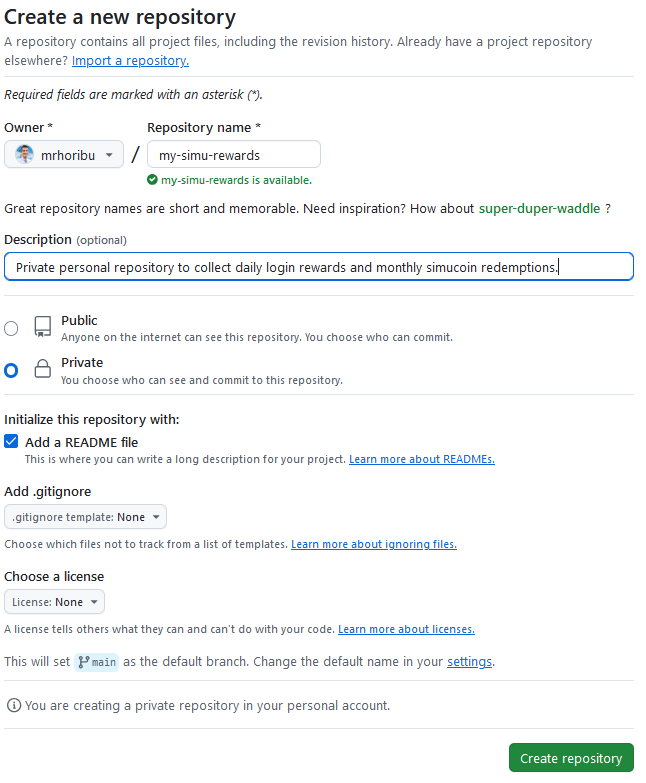
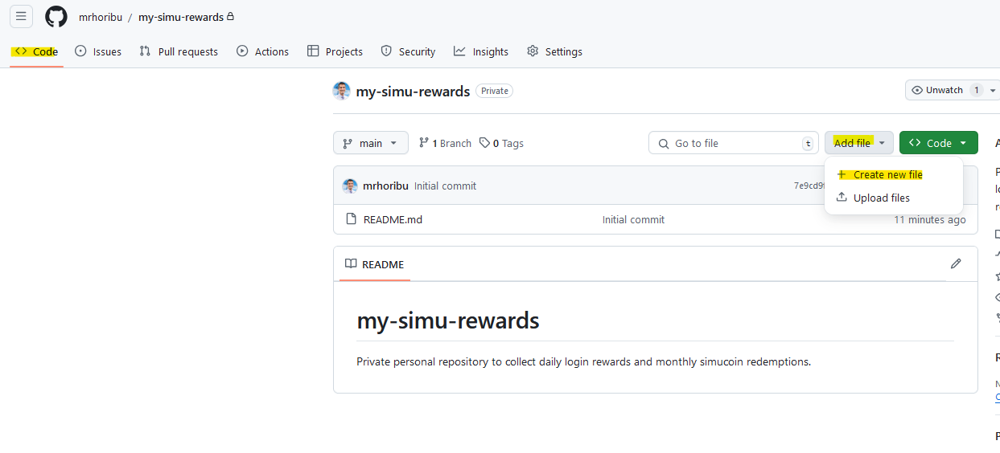
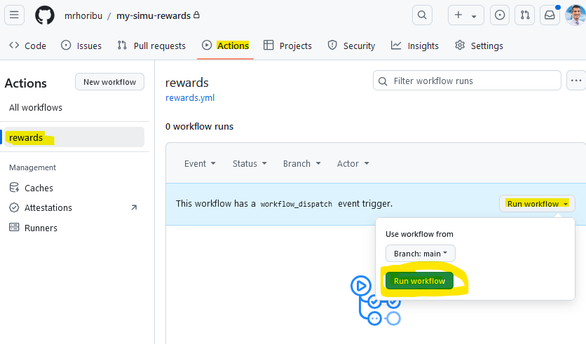

# Daily Simutronic Rewards

**ALWAYS USE GITHUB SECRETS**

Secret to be used for account and password are required, game is optional but defaults to GS3. Be sure to set repository to private to avoid Github's cron disabling if no activity within 60 days limitation.
Game Code Options:
* GS3 - Gemstone Prime
* GST - Gemstone Test
* GSX - Gemstone Platinum
* GSF - Gemstone Shattered
* DR  - DragonRealms Prime
* DRT - DragonRealms Test
* DRX - DragonRealms Platinum
* DRF - DragonRealms Fallen

example usage with CRON (Times in UTC):

```yaml
#.github/workflows/rewards.yml
name: rewards
on:
  workflow_dispatch:
  schedule:
    # CRON Generator Link: https://crontab.guru/#5_1_*_*_*
    # Below is 01:05 AM UTC
    - cron: "5 1 * * *"
jobs:
  login-account:
    runs-on: ubuntu-latest
    name: login account
    timeout-minutes: 5
    steps:
      - uses: ondreian/simu-rewards@v1.1.0
        with:
          account: ${{ secrets.ACCOUNT1 }}
          password: ${{ secrets.PASSWORD1 }}
      - uses: ondreian/simu-rewards@v1.1.0
        with:
          account: ${{ secrets.ACCOUNT2 }}
          password: ${{ secrets.PASSWORD2 }}
          game: ${{ secrets.GAMECODE2 }}
```

# Detail Setup Instructions

1. Create a GitHub account and upon logging in, create a new GitHub __**PRIVATE**__ repository by going to https://github.com/new

2. After creating the new repository, you'll want to add repository secrets for each account you'll want to have processed. To do this, go to the Settings of the newly created repository, then to Secrets and variables, then selection Actions under that. From here create an ACCOUNT1, PASSWORD1, GAMECODE1 and populate each with the appropriate information. Repeat for each additional account by increasing the nubmer associated to the new account you wish to add.

Game Code Options:
* GS3 - Gemstone Prime
* GST - Gemstone Test
* GSX - Gemstone Platinum
* GSF - Gemstone Shattered
* DR  - DragonRealms Prime
* DRT - DragonRealms Test
* DRX - DragonRealms Platinum
* DRF - DragonRealms Fallen

3. Next you'll want to create the github action that does all the magic. To do this, create a new file under the Code view of your repository as shown

4. On the next page, copy/paste the rewards.yml example code into the newly file window and commit changes. Take note on the fact you need to duplicate/modify the "steps" section depending on how many accounts you added. Also do not forget to update the CRON time if you do not want the job to run at 1:05AM UTC. Be sure to name your file .github/workflows/rewards.yml. It should expand out automatically as shown here

```yaml
#.github/workflows/rewards.yml
name: rewards
on:
  workflow_dispatch:
  schedule:
    # CRON Generator Link: https://crontab.guru/#5_1_*_*_*
    # Below is 01:05 AM UTC
    - cron: "5 1 * * *"
jobs:
  login-account:
    runs-on: ubuntu-latest
    name: login account
    timeout-minutes: 5
    steps:
      - uses: ondreian/simu-rewards@v1.1.0
        with:
          account: ${{ secrets.ACCOUNT1 }}
          password: ${{ secrets.PASSWORD1 }}
      - uses: ondreian/simu-rewards@v1.1.0
        with:
          account: ${{ secrets.ACCOUNT2 }}
          password: ${{ secrets.PASSWORD2 }}
          game: ${{ secrets.GAMECODE2 }}
```


5. You are now done. You can either wait till the next CRON time for it to automatically run, or you can manually kick off a run by going to Actions -> rewards and then run the workflow.

